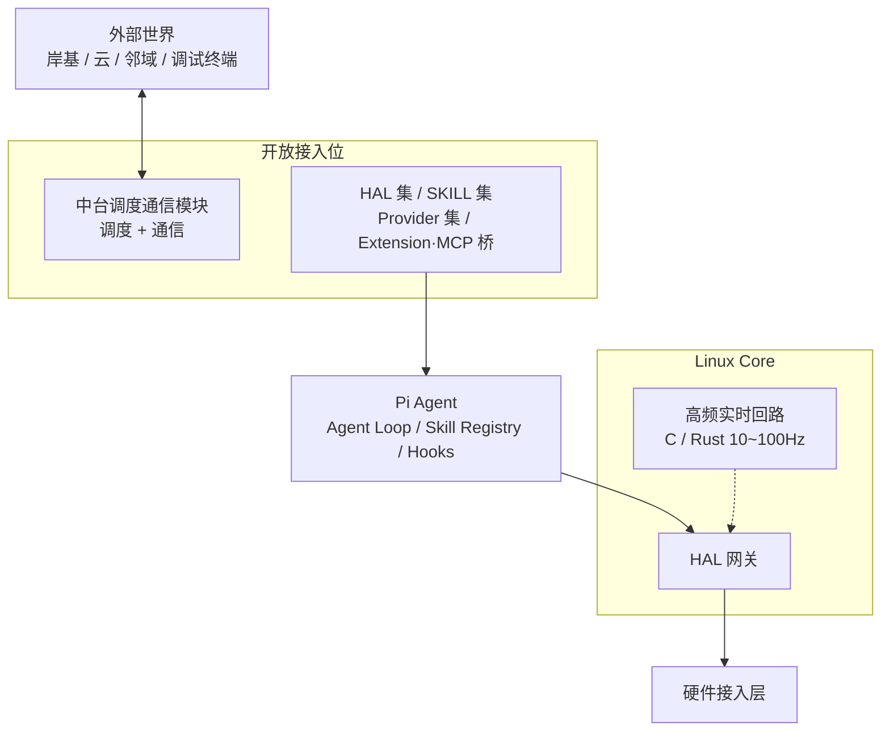
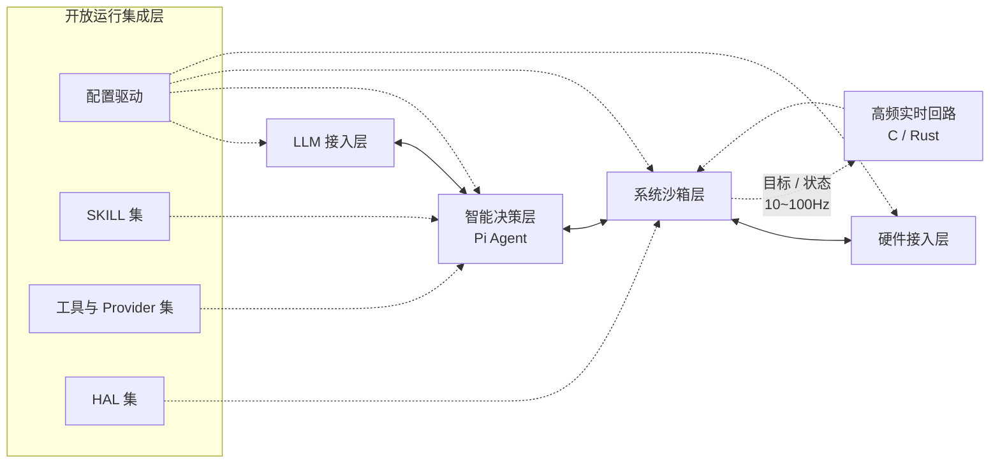

# 太昊 OS (Taihao OS)

> 智能终端 / 机器人设备端 OS；以 Linux Core 为底座、Pi Agent 为唯一智能决策层、开放接入位承载垂直差异。

## 一句话定位

太昊 OS = **Linux Core + Pi Agent + 开放接入位**。

三件套解耦：垂直差异全部走接入位，OS Core 与 Pi Agent 不为具体终端形态定制。

## 核心能力

1. **网联对接**：上电激活后与外部控制侧建立远程连接，接收任务、回传执行结果。由中台调度通信模块承载，对接对象（岸基 / 云 / 邻域）由厂商配置决定。
2. **自主组网**：上电后依据配置完成 Mesh 域组网，与同区域设备自动 AP 组网，支撑智能集群工作模式。
3. **任务执行**：依据任务参数完成路径规划、运动控制、感知融合、执行反馈。
4. **边缘自治**：作业过程中自主执行四类本地决策：
   - **紧急避险**：感知碰撞、缠绕、低电、严重传感器异常等紧急场景，立即触发保护动作（停机、悬停、脱离作业区、上浮等）
   - **故障自愈**：监测异常时自动尝试本地恢复或降级运行（重连链路、切换通信通道、临时关闭故障模块等）；恢复失败则上报进入维护流程
   - **多机避障**：依托本地 Mesh 感知邻域设备位置与运动意图，路径规划中自动避让
   - **分区协同**：依据邻域拓扑与作业能力动态划分作业子区域，多台设备并行覆盖、互不重叠地完成任务
5. **生态开放**：对外暴露统一接口协议与 SDK，供硬件开发者与集成服务商接入自研边缘模型与设备能力。

## 设计思路

### 分层架构图

### 三段式骨架

| 段 | 角色 | 实现 |
| --- | --- | --- |
| **Linux Core** | OS 底座 | 裁剪内核 + 四层隔离栈（iptables / namespaces / seccomp+eBPF / AppArmor）+ HAL 网关 + C/Rust 高频实时回路（10~100Hz）+ 固件三分区 |
| **Pi Agent** | 唯一智能决策层 | Agent Loop / Skill Registry / Extension / Hooks / AGENTS.md / SYSTEM.md；受限 namespace、无 capabilities；仅以 ≤1Hz 下发目标与模式 |
| **开放接入位** | 垂直差异承载位 | HAL 集 + SKILL 集 + Provider 集 + Extension·MCP 桥；厂商可写业务分区 |

### 开放接入位四槽

- **HAL 集**：硬件驱动接入点（spidev / i2c-dev / V4L2 / SocketCAN / pwmchip / serial / 水声通信机 / …）
- **SKILL 集**：策略 / 任务 / 自治能力 SKILL.md 包（紧急避险 / 故障自愈 / 多机避障 / 分区协同 / 路径规划 / 感知融合 / …）
- **Provider 集**：模型 / 工具 / 中台调度通信模块的 Provider 注册；任意 OpenAI 兼容端点 + 自定义协议
- **Extension·MCP 桥**：扩展与 MCP 桥接，接入自研边缘能力

### 中台调度通信模块

- **位置**：位于 Pi Agent 与外部系统之间，**作为接入位实现**，不出现在 OS Core 或 Agent Loop
- **职责**：
  - **调度**：任务编排、消息路由、双链路选择、故障切换
  - **通信**：协议适配（MQTT 3.1.1 / Modbus / 自研二进制 / WebSocket / SSE / …）
- **对接对象**：由厂商配置决定——岸基 / 云端 / 邻域机器人 / 调试终端均可；OS 出厂不预设

### 核心安全准则

OS 实现层两条核心安全准则：

**LLM 不直接下场做实时控制**。100Hz 推进器 / 姿态 / 避障回路由 Linux Core 内 C/Rust 高频进程承担；Pi Agent 仅以 ≤1Hz 下发目标与模式。LLM 回路延迟 200ms~3s，不足以承担 10ms 周期的 PWM 控制。

**LLM 不绕过 HAL 网关直接驱动硬件**。CORE → HW 必须经 Pi Agent SKILL 调用触发，所有 SKILL 调用必经 HAL 网关白名单校验、审计日志落盘。Pi Agent 进程跑在受限 namespace、无任何 capabilities；HAL 网关持有 CAP_SYS_RAWIO / CAP_NET_ADMIN。

### 固件三分区

| 分区 | 写权限 | 内容 | 升级行为 |
| --- | --- | --- | --- |
| **只读系统分区** | 项目维护 | 裁剪 Linux 内核、Pi Agent runtime、推理库、通信协议栈、调度内核、进程保活机制、HAL 网关 | 升级覆盖 |
| **全局配置分区** | 可读写 | LLM provider、SKILL 白名单、HAL 工具白名单、安全分级、告警阈值、上报频率、组网参数、中台配置 | 升级保留 |
| **业务开发分区** | 厂商可读写 | 外设驱动、机构控制逻辑、定制 SKILL 包 / Extension / Hooks / Prompt Template | 升级保留 |

### 双链路

| 链路 | 主要通道 | 冗余通道 | 建立时机 |
| --- | --- | --- | --- |
| **远程通信** | 4G/5G、Wi-Fi | 卫星回传（可选扩展） | 上浮水面或处于通信覆盖范围时 |
| **本地 Mesh 集群** | Wi-Fi Mesh 自组网 | 水声通信（深水场景切换） | 上电持续激活 |

两链路相互独立并行；远程中断不影响本地集群协同。

### 四层运行时 + 开放运行集成层

开放运行集成层不与四层并列，叠加其上：

- **配置驱动**：`/etc/taihao-os/` YAML/JSON 编排四层；systemd EnvironmentFile 与内核 cmdline 运行时覆盖
- **SKILL 集**：SKILL.md 目录（系统级 `/usr/share/taihao-os/skills/` + 厂商级 `/etc/taihao-os/skills/`）；签名 / 版本 / 分发 / 安全分级
- **工具与 Provider 集**：Extension / MCP 桥接入自定义工具；`models.json` 注册任意 OpenAI 兼容端点
- **HAL 集**：自定义驱动通过 HAL 网关注册；新增外设无需修改系统底座

#### 四层运行时结构

## 目标硬件

- **主控**：RK3588 同级别（Cortex-A76/A55 八核 + NPU INT8 ≥ 6TOPS，可跑 7B 量化模型）
- **存储**：16GB eMMC
- **架构**：arm64（真机部署）+ amd64（开发 / QEMU 仿真）
- **总线**：UART / I2C / SPI / PWM / CAN（HAL 集按统一接口规范对接）
- **通信**：Wi-Fi 5/6 + AP + Mesh（802.11s 自组网）；外接水声通信机（HAL 集）；可选 4G/5G 模组

## 构建 / 烧录 / 验证

- **构建**：基座 Buildroot（用户态构建系统）+ Linux 6.6 LTS + PREEMPT_RT 内核；构建产物 = 智能 OS 镜像（amd64 / arm64）+ 签名 + SBOM + 溯源
- **烧录**：dd to raw device（工厂产线）+ OTA（部署后远程升级，A/B 双系统分区 + 失败回滚）
- **仿真**：QEMU amd64 + aarch64 必须可启动（CI 强制）
- **许可证**：Apache-2.0

## 致谢

- [Linux 内核](https://www.kernel.org/) 及生态（namespaces / seccomp / AppArmor / iptables / eBPF）—— 四层隔离栈与能力裁减基础
- **Linux + Pi Agent** 设计形态 —— 太昊三段式骨架（Linux Core + Pi Agent + 开放接入位）的源头思路