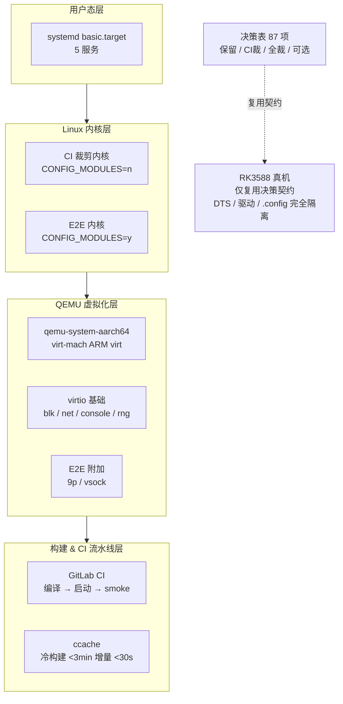

```mermaid
graph TD
  subgraph L1[用户态层]
    S1[systemd basic.target<br/>5 服务]
  end
  subgraph L2[Linux 内核层]
    K1[CI 裁剪内核<br/>CONFIG_MODULES=n]
    K2[E2E 内核<br/>CONFIG_MODULES=y]
  end
  subgraph L3[QEMU 虚拟化层]
    Q1[qemu-system-aarch64<br/>virt-mach ARM virt]
    Q2[virtio 基础<br/>blk / net / console / rng]
    Q3[E2E 附加<br/>9p / vsock]
  end
  subgraph L4[构建 & CI 流水线层]
    B1[GitLab CI<br/>编译 → 启动 → smoke]
    B2[ccache<br/>冷构建 <3min 增量 <30s]
  end
  DECISION[决策表 87 项<br/>保留 / CI裁 / 全裁 / 可选]
  RK[RK3588 真机<br/>仅复用决策契约<br/>DTS / 驱动 / .config 完全隔离]

  L1 --> L2
  L2 --> L3
  L3 --> L4
  DECISION -.复用契约.-> RK
```
