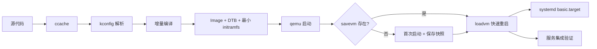
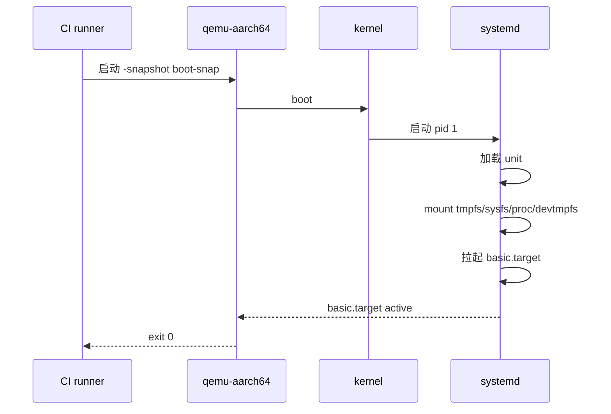

# Linux 内核裁剪方案（qemu-aarch64 仿真原型平台）

| 版本号 | 日期 | 变更摘要 | 修订来源 |
| --- | --- | --- | --- |
| v0.0.7 | 2026-08-07 | §9 步骤 1 对齐 §2.4 config 命名,采用架构后缀形式 | 用户+AI |
| v0.0.6 | 2026-08-07 | §1 加 amd64 双架构声明 + 等价替换规则;§2.3 去模块缓存;§2.4 config 加架构后缀;io_uring 从 §5.4 移到 §5.6;§5.7 #47 拆 virtio-rng;§5.8 #53 串口理由改;§5.9 加 virtio-rng;整表重排 #1~#87 | 用户+AI |
| v0.0.5 | 2026-08-07 | OTA 路径定 A/B 分区 bootloader 切换:§5.13/§6/§8 三处 kexec 表述统一 | 用户+AI |
| v0.0.4 | 2026-08-07 | 9 条判级改 CI 裁 + §6 BPF 标(仅端到端) + 决策表新增 3 行(USB/vsock/crypto) + 整表重排 #1~#86 | 用户+AI |
| v0.0.3 | 2026-08-07 | 合并修订:7 条评审修订落实 + §3.1/§5 闭环核验 | 用户+AI |
| v0.0.2 | 2026-08-07 | 清理历史化措辞(修改/变更/草案/旧版/新版等)6 处,文档保持终态 | AI |
| v0.0.1 | 2026-08-07 | 初始定稿:场景/差异化/83 项决策/4 条红线/真机差异备注 | 用户+AI |

> 本文件给出太昊 OS 在 **qemu-aarch64 仿真原型开发验证平台** 上的 Linux 内核裁剪方案。
> 服务对象是开发期的快速集成验证,不是生产部署。

## 1. 场景定位

| 项 | 取值 |
| --- | --- |
| 目标平台 | qemu-aarch64 virt machine |
| 内核版本 | Linux 6.6 LTS |
| 用途 | 原型开发验证 / CI 冒烟 / 端到端集成验证 |
| 实时策略 | 不上 PREEMPT_RT（迭代速度优先） |
| 与真机关系 | 配置分离;仅共享子系统裁剪决策 |
| 开发主机架构 | amd64(Linux VM / UTM / Lima / macOS host) |
| 仿真平台 | qemu-aarch64(主) / qemu x86_64(amd64 等价复用) |

双架构共享同一决策表;amd64 侧对 §5 平台相关条目做等价替换:`pl011` → `8250(16550A)`、`pl031` → `RTC_CMOS`、`arch timer` → `TSC + HPET`、`PSCI` → `ACPI`、`qemu virt DTS` → `qemu q35`。其余条目架构中立,零差异。

仿真平台的核心约束是 **迭代速度** 与 **端到端集成可重复**,而不是体积最小化或硬实时保证。

## 2. 顶层约束

### 2.1 两套内核并存

| 名称 | 角色 | 通过标准 | 内核配置 |
| --- | --- | --- | --- |
| **CI 冒烟内核** | 提交门禁;验证 kernel + systemd pid 1 + cgroup + mount + 基础 IO | qemu 启动后 systemd 到达 `basic.target` | 最小集 + virtio-net loopback |
| **端到端内核** | 完整集成验证;跑 pi-agent / hal-gateway / rt-loop / comm-center / extension-bridge 全套服务 | 全部服务 systemd unit `active` | 保留全部接入位所需子系统 |

两套内核从同一份 **子系统裁剪决策表** 派生,各自生成独立 `.config`;两者均从同一份 `defconfig` 出发,通过 fragment 机制叠加各自差异化选项,共享基线。

### 2.2 CI 冒烟内核红线

| 红线 | 说明 |
| --- | --- |
| **禁止业务硬件模拟驱动内置** | SPI / I2C / GPIO / V4L2 / CAN / SocketCAN / PWM / WATCHDOG / hwmon 等接入位硬件接口一律不进入 CI 内核,防止 CI 门禁隐性依赖 HAL 硬件节点 |
| **禁止内核模块** | `CONFIG_MODULES=n`,全部功能内置编译进 zImage,杜绝 CI 出现"模块缺失"漏测 |
| **禁止兼容 cgroup v1** | 统一走 cgroup v2 单一模式,systemd 配置不开 v1 fallback,降低配置复杂度 |
| **禁止业务共享目录** | virtio-9p / virtio-fs 不进 CI,主机目录共享仅 E2E 调试时启用 |

红线之外的"保留"集合,见 § 3.1 与 § 5 裁剪决策表。

### 2.3 迭代速度硬指标

| 阶段 | 目标 | 技术手段 |
| --- | --- | --- |
| 冷构建 | < 3 min | ccache + 预下载源码 + 并行 make |
| 增量构建 | < 30 s | ccache 命中 + kconfig 增量 |
| qemu 重启 | < 2 s | qemu `savevm` 内存快照 + 直接 `loadvm` |
| 主机目录热替换 | 即时 | virtio-9p / virtio-fs 共享 rootfs 上层(仅 E2E) |

### 2.4 配置分离原则

仿真内核与未来真机内核 **共用同一份子系统裁剪决策表**(见第 5 节),但各自维护独立 `.config` 片段:

```
config/
├── kernel/
│   ├── trimming-decisions.md       # 决策表(共享,双架构中立)
│   ├── qemu-aarch64-ci.config      # CI 冒烟内核 aarch64
│   ├── qemu-aarch64-e2e.config     # 端到端内核 aarch64
│   ├── qemu-x86_64-ci.config       # CI 冒烟内核 amd64(复用决策表,平台节等价替换)
│   ├── qemu-x86_64-e2e.config      # 端到端内核 amd64
│   └── real-rk3588.config          # 真机内核(未来)
```

## 3. 两套内核差异化策略

### 3.1 CI 冒烟内核 · 最小集

裁掉一切与"启动到 systemd basic.target"无关的子系统,只保留基线。

**保留**:

| 类别 | 内容 |
| --- | --- |
| 伪文件系统 | tmpfs / devtmpfs / devpts / sysfs / proc |
| 块设备 | virtio-blk / virtio-scsi / loop |
| 网络 | virtio-net (loopback only) / loopback |
| 控制台 | virtio-console / 8250 / pl011 |
| 时间 | virtio-rng / arch timer / pl031 |
| 平台 | arm64 generic / qemu virt DTS / earlycon / earlyprintk / ACPI / PSCI |
| 安全 | namespaces全集(PID/NET/IPC/UTS/USER/MOUNT/CGROUP/TIME) / capabilities / seccomp / AppArmor / Yama |
| 调度 | CFS + SCHED_NORMAL/BATCH/IDLE + SCHED_FIFO/RR / cgroup v2 only / cpuset / isolcpus |
| 内存 | THP / hugetlb / KSM |
| 调试 | printk / dmesg / magic SysRq / IKCONFIG |
| 压缩 | zstd |
| 启动 | EFI / U-Boot / initramfs (最小) |

**裁掉**:CAN / SocketCAN / 全部物理网卡 / USB / 声卡 / DRM / V4L2 / SPI / I2C / GPIO / PWM / WATCHDOG / hwmon / FUSE / overlayfs / 9p / virtio-fs / virtio-gpu / virtio-input / virtio-vsock / virtio-crypto / kexec / kdump / suspend / hibernate / NUMA balancing / System V IPC / POSIX mqueue / BPF / ftrace / perf / kprobes / bpf syscall / SCHED_DEADLINE / `CONFIG_MODULES=n`(CI 不支持内核模块,全部功能内建) / cgroup v1 / NPU / GPU / VPU 驱动。

### 3.2 端到端内核 · 扩展边界

在 CI 最小集基础上 **恢复** 接入位必需子系统,见第 5 节裁剪决策表的"保留"列。

## 4. 快速迭代技术栈

### 4.1 构建加速



### 4.2 文件系统共享策略

| 场景 | 方式 | 挂载点 |
| --- | --- | --- |
| 主机源代码 / 构建产物 | virtio-9p | `/mnt/host` |
| rootfs 持久层 | ext4 镜像 | `/` |
| 运行时临时数据 | tmpfs | `/run`、`/tmp` |
| systemd 状态 | tmpfs + 重启不保留 | `/run/systemd` |

`virtio-9p` 用于把主机的 `out/`、`src/`、`config/` 目录透传到 qemu 内部,避免重建 rootfs 镜像。**仅 E2E 启用,CI 冒烟不开**(见 § 2.2 红线)。

### 4.3 qemu 快照策略

- **基础快照**:首次冷启动后保存 `vmstate` + `memory`,标记为 `boot-snap`
- **增量构建**:ccache 命中后增量编译 → 替换内核镜像 → `loadvm boot-snap` → qemu 2s 内重启
- **快照回退**:验证失败时 `loadvm boot-snap` 立即回退,无需重新初始化
- **内核镜像替换边界**:`loadvm` 不能切换内核镜像。当 Image 替换后,既有 `boot-snap` 快照失效,**必须重新冷启动并保存新一份快照**,禁止用既有快照加载替换后的内核。内核内存镜像与磁盘镜像不一致会引发不可复现异常

## 5. 子系统裁剪决策表

> 表头 `决策` 列含义:
> - **保留**:两套内核都开
> - **CI 裁**:仅 CI 冒烟内核裁掉;端到端内核保留
> - **全裁**:两套内核都裁掉
> - **可选**:按需开启;默认关,接入位明确需要时打开

### 5.1 网络协议栈

| # | 子系统 | 决策 | 理由 |
| --- | --- | --- | --- |
| 1 | TCP / UDP / IPv4 / IPv6 | 保留 | comm-center / mesh UDP 基线 |
| 2 | ICMP / ping | 保留 | 排错 |
| 3 | unix domain socket / packet socket / netlink | 保留 | 工具通信 |
| 4 | loopback / bridge | 保留 | 本地拓扑 |
| 5 | SCTP / DCCP / RDS / TIPC / RXRPC | 全裁 | 端到端用不到 |
| 6 | Appletalk / IPX / DECnet / Econet / WAN 协议 | 全裁 | 古董协议 |
| 7 | Bluetooth / WiFi 协议栈 | 全裁 | 留给真机 / 厂商 HAL |
| 8 | NFC / IRDA / amateur radio | 全裁 | 端到端无场景 |
| 9 | CAN / SocketCAN | CI 裁 | hal-gateway 用 device node;CI 不验证服务 |
### 5.2 文件系统

| # | 子系统 | 决策 | 理由 |
| --- | --- | --- | --- |
| 10 | ext4 | 保留 | rootfs |
| 11 | tmpfs / devtmpfs / devpts / sysfs / proc / configfs | 保留 | systemd + userspace 基线 |
| 12 | overlayfs | CI 裁 | 容器场景 / rootfs 上层;CI 不依赖容器 |
| 13 | virtio-9p / virtio-fs | CI 裁 | E2E 内核保留;仅端到端调试需要主机目录共享,CI 冒烟不需要 |
| 14 | squashfs | 可选 | 只读 rootfs 备用 |
| 15 | FUSE | CI 裁 | sandbox 沙箱友好;CI 不依赖 sandbox |
| 16 | btrfs / xfs / f2fs / NTFS / exFAT | 全裁 | 留给真机 |
| 17 | jffs2 / ubifs / cramfs | 全裁 | 留给真机 |
| 18 | NFS client | 可选 | 网络文件系统;按需 |
### 5.3 安全 / 沙箱

| # | 子系统 | 决策 | 理由 |
| --- | --- | --- | --- |
| 19 | namespaces（PID/NET/IPC/UTS/USER/MOUNT/CGROUP/TIME） | 保留 | systemd 沙箱四层隔离栈基线 |
| 20 | seccomp BPF | 保留 | extension-bridge 沙箱 |
| 21 | capabilities | 保留 | sandbox |
| 22 | AppArmor | 保留 | 主 LSM(与 SELinux 二选一,选 AppArmor) |
| 23 | SELinux / SMACK | 全裁 | 已被 AppArmor 替代 |
| 24 | Yama | 保留 | ptrace 边界 |
| 25 | IMA / EVM | 可选 | 度量场景 |
| 26 | LandLock | 可选 | 沙箱补充 |
| 27 | TPM | 全裁 | qemu 仿真意义有限 |
### 5.4 调试 / 可观测性

| # | 子系统 | 决策 | 理由 |
| --- | --- | --- | --- |
| 28 | printk / dmesg / magic SysRq / IKCONFIG | 保留 | 排错基线 |
| 29 | ftrace / perf events | CI 裁 | rt-loop 抖动排查;CI 不排查抖动 |
| 30 | kprobes / uprobes / bpf syscall / BPF JIT | CI 裁 | 可观测性;CI 不依赖可观测性 |
| 31 | kdump / crashkernel | 全裁 | 仿真无意义 |
| 32 | lockdep / kmemleak / kcsan / KASAN / UBSAN | 可选 | 仅 debug build 开 |
| 33 | kgdb / kdb | 全裁 | 仿真无硬件 breakpoint |
### 5.5 IPC

| # | 子系统 | 决策 | 理由 |
| --- | --- | --- | --- |
| 34 | pipe / unix socket / eventfd / signalfd / timerfd / inotify / fanotify / epoll | 保留 | 全场景基线 |
| 35 | System V IPC | CI 裁 | systemd 原生无强制依赖;E2E 可选开启,精简 CI 基线 |
| 36 | POSIX mqueue | CI 裁 | 同上 |
| 37 | POSIX shmem | 保留 | systemd 部分组件仍依赖 /dev/shm POSIX 语义 |
| 38 | 遗留 IPC | 全裁 | systemd 不依赖 |
### 5.6 块设备 / IO

| # | 子系统 | 决策 | 理由 |
| --- | --- | --- | --- |
| 39 | virtio-blk / virtio-scsi / loop | 保留 | 块设备 |
| 40 | io_uring | 保留 | 高频 IO |
| 41 | DM (device-mapper) | CI 裁 | 端到端保留用于容器 / 块设备映射 / dm-verity;CI 不依赖 DM |
| 42 | md (RAID) | 可选 | 按需 |
| 43 | MFM / RLL / ESDI / IDE / PATA | 全裁 | 古董 |
| 44 | mtip32xx | 全裁 | 厂商专用 |
### 5.7 网络设备

| # | 子系统 | 决策 | 理由 |
| --- | --- | --- | --- |
| 45 | virtio-net / loopback | 保留 | qemu 网络 |
| 46 | tun / tap | CI 裁 | mesh UDP 透传;CI 不验证 mesh |
| 47 | virtio-balloon | 保留 | qemu 平台内存气泡 |
| 48 | virtio-vsock | CI 裁 | host-guest socket;端到端调试可选 |
| 49 | virtio-crypto | CI 裁 | 硬件加速 crypto;端到端调试可选 |
| 50 | 全部物理网卡驱动 | 全裁 | qemu 不需要 |
| 51 | WiFi / WWAN / Bluetooth 设备驱动 | 全裁 | 端到端无场景 |
### 5.8 输入 / 显示 / 控制台

| # | 子系统 | 决策 | 理由 |
| --- | --- | --- | --- |
| 52 | virtio-console | 保留 | serial console |
| 53 | 8250 / pl011 / AMBA-pl011 串口 | 保留 | console(控制台基线);hal-gateway 不依赖串口 |
| 54 | virtio-input | CI 裁 | qemu 键盘鼠标;CI 不需要交互 |
| 55 | virtio-gpu + DRM / KMS | CI 裁 | 调试 / 监控渲染;CI 不渲染 |
| 56 | framebuffer 简单驱动 | CI 裁 | virtio-gpu fallback;CI 不需要 framebuffer |
| 57 | HID / 触摸 / 物理键盘驱动 | 全裁 | 端到端无场景 |
| 58 | 声卡（OSS / ALSA / sound） | 全裁 | 端到端用不到 |
### 5.9 字符 / 平台设备

| # | 子系统 | 决策 | 理由 |
| --- | --- | --- | --- |
| 59 | SPI / I2C / GPIO（spidev / i2c-dev / gpiochip 设备节点） | CI 裁 | hal-gateway 用 device node;CI 不验证服务 |
| 60 | PWM / pwmchip | CI 裁 | 同上 |
| 61 | V4L2 / media / videobuf2 | CI 裁 | hal-gateway camera |
| 62 | WATCHDOG / hwmon | CI 裁 | rt-loop 健康检查 |
| 63 | RTC（pl031 / rtc-generic） | 保留 | 时间同步 |
| 64 | CPU frequency / cpuidle | 保留 | 性能调节 |
| 65 | virtio-rng | 保留 | qemu 平台熵源 |
| 66 | USB 控制器驱动 (xhci / ehci / ohci) | CI 裁 | 端到端可选;CI 不验证 USB 外设 |
### 5.10 电源 / 内存

| # | 子系统 | 决策 | 理由 |
| --- | --- | --- | --- |
| 67 | THP / hugetlb / KSM | 保留 | 内存优化 |
| 68 | zswap / zram | 可选 | 仿真用不到 |
| 69 | swap | 可选 | 端到端 4GB RAM 可能不需要 |
| 70 | suspend / hibernate | 全裁 | 仿真无意义 |
| 71 | NUMA balancing | 全裁 | qemu 默认非 NUMA |
### 5.11 调度 / cgroup

| # | 子系统 | 决策 | 理由 |
| --- | --- | --- | --- |
| 72 | CFS + SCHED_NORMAL/BATCH/IDLE | 保留 | 基线 |
| 73 | SCHED_FIFO / SCHED_RR | 保留 | rt-loop 实时任务 |
| 74 | SCHED_DEADLINE | 全裁 | 端到端用不到 |
| 75 | cgroup v1 | 全裁 | 统一采用 systemd cgroup v2 单一模式,降低配置复杂度 |
| 76 | cgroup v2 controllers (cpuset / memory / cpu / io / pids / freezer) | 保留 | systemd 资源切片 + rt-loop 隔离基线 |
| 77 | isolcpus | 保留 | rt-loop CPU 隔离(仿真里模拟效果) |
### 5.12 模块化

| # | 子系统 | 决策 | 理由 |
| --- | --- | --- | --- |
| 78 | `CONFIG_MODULES` (端到端) | 保留 | 可选驱动按需加载 |
| 79 | `CONFIG_MODULES` (CI 冒烟) | 全裁 | 全部功能内置编译进 zImage,杜绝"模块缺失"漏测 |
### 5.13 启动 / 平台

| # | 子系统 | 决策 | 理由 |
| --- | --- | --- | --- |
| 80 | EFI / U-Boot boot | 保留 | qemu pflash + chain |
| 81 | ACPI / PSCI | 保留 | qemu 平台 |
| 82 | earlycon / earlyprintk | 保留 | 排错 |
| 83 | arm64 generic timer / qemu virt DTS | 保留 | 平台基础 |
| 84 | kexec | 全裁 | OTA 走 A/B 双系统分区 + bootloader 切换;内核不依赖 kexec |
### 5.14 NPU / GPU / VPU

| # | 子系统 | 决策 | 理由 |
| --- | --- | --- | --- |
| 85 | NPU 厂商驱动（RKNN / 华为 NPU / …） | 全裁 | 真机才需要;仿真跑 LLM 走远端 provider |
| 86 | GPU 厂商驱动（Mali / Adreno / …） | 全裁 | 同上 |
| 87 | VPU 视频编解码硬件加速 | 全裁 | 同上 |
## 6. 关键 CONFIG_ 单独标记

> 仅列出会显著影响行为 / 性能 / 安全的选项;其余沿用上游默认。

| CONFIG | 取值 | 备注 |
| --- | --- | --- |
| `PREEMPT_VOLUNTARY` | y | 不上 RT patch;迭代速度优先 |
| `PREEMPT_RT` | n | 真机才考虑 |
| `HZ=1000` | y | rt-loop 抖动窗口 |
| `NO_HZ_FULL` | y | 隔离核更平滑 |
| `IKCONFIG` / `IKCONFIG_PROC` | y | 内核自带配置 |
| `MAGIC_SYSRQ` | y | 排错 |
| `SECURITY` | y | LSM 入口 |
| `SECURITY_APPARMOR` | y | 主 LSM |
| `SECCOMP` / `SECCOMP_FILTER` | y | 沙箱 |
| `NAMESPACES` 全集 | y | 沙箱 |
| `CGROUP_*` v2 子集 | y | systemd(单一 v2 模式,不开 v1 fallback) |
| `BPF` / `BPF_SYSCALL` / `BPF_JIT` | y (仅端到端) | 可观测性 |
| `DEBUG_KERNEL` | n | 性能优先 |
| `LOCKDEP` / `KMEMLEAK` / `KASAN` / `UBSAN` | n(debug build 开) | 性能 |
| `STATIC_USERMODEHELPER` | y | 安全 |
| `CHECKPOINT_RESTORE` | y | 系统恢复 |
| `MODULES` (CI) | n | **硬约束**:CI 内核禁止任何模块,全部功能内建进 zImage,杜绝"模块缺失"漏测 |
| `MODULES` (端到端) | y | 可选驱动按需加载 |
| 内核压缩 | zstd | 启动速度 |
| `KEXEC` | n | OTA 走 A/B 双系统分区 + bootloader 切换 |

## 7. CI 冒烟验收标准

### 7.1 启动流程



### 7.2 通过判据

| 检查项 | 命令 | 期望 |
| --- | --- | --- |
| systemd pid 1 | `systemctl is-system-running` | running |
| basic.target | `systemctl is-active basic.target` | active |
| cgroup v2 | `stat -fc %T /sys/fs/cgroup` | cgroup2fs |
| namespace | `ls /proc/1/ns/` | 8 个命名空间 |
| virtio-net | `ip link show` | lo + eth0 |
| mount | `mount \| wc -l` | ≥ 5 (root + tmpfs + sysfs + proc + devtmpfs) |

任一检查失败 → CI 红,需排查 kernel config / unit 配置 / 启动日志。

### 7.3 CI 超时

| 阶段 | 超时 |
| --- | --- |
| qemu 启动到 basic.target | 30 s |
| 冒烟脚本执行 | 10 s |
| 总计 | 60 s |

## 8. 与未来真机配置的关系

仿真平台与真机部署共享 **子系统裁剪决策表**(第 5 节)中"保留"列的语义,但具体实现路径分离:

| 维度 | 仿真 | 真机（未来） |
| --- | --- | --- |
| 平台 | qemu virt DTS | RK3588 DTS |
| 网络设备 | virtio-net | rk3588 gmac / 厂商 WiFi |
| 块设备 | virtio-blk | eMMC / SD 控制器 |
| 控制台 | virtio-console + pl011 | 物理串口 |
| 实时 | `PREEMPT_VOLUNTARY` | `PREEMPT_RT_FULL` |
| NPU / GPU | 全裁 | 厂商驱动 |
| 文件系统 | ext4 | ext4 + 厂商加密 |
| kexec | n | n (A/B 分区 bootloader 切换,真机也不走 kexec) |
| `NO_HZ_FULL` | y(模拟 CPU 隔离效果) | 启用 PREEMPT_RT 后需重新评估开销,不直接复用仿真 CONFIG |

真机配置在独立 `.config` 文件中维护(`real-rk3588.config`);子系统裁剪决策表是 **共享契约**,两份配置都从契约推导。

**`NO_HZ_FULL` 真机备注**:仿真平台打开 `NO_HZ_FULL` 用于模拟 CPU 隔离、压低 rt-loop 抖动窗口;RK3588 真机若启用 `PREEMPT_RT_FULL`,需要重新评估 tickless 对实时任务唤醒延迟的影响,不能直接把仿真 CONFIG 拷过去。RT 模式下动态 tick 的省电收益会被可观测性开销抵消,需要结合 `tuned` profile 与 rt-loop 实测数据再决策。

## 9. 实施步骤

1. 基于 `defconfig` 生成 `qemu-aarch64-ci.config`、`qemu-aarch64-e2e.config`、`qemu-x86_64-ci.config`、`qemu-x86_64-e2e.config`
2. 按子系统裁剪决策表逐项 review,补齐缺失选项
3. 跑一次冷构建验证 < 3 min 目标,设置 ccache 缓存目录
4. 启动 qemu + savevm `boot-snap`,验证 < 2 s 重启(**内核镜像替换后必须重新生成快照**,见 § 4.3)
5. CI 冒烟脚本接入 gitlab-ci / github actions,验证 basic.target 验收
6. 端到端集成验证:跑 pi-agent + hal-gateway + rt-loop + comm-center + extension-bridge 全套 systemd unit