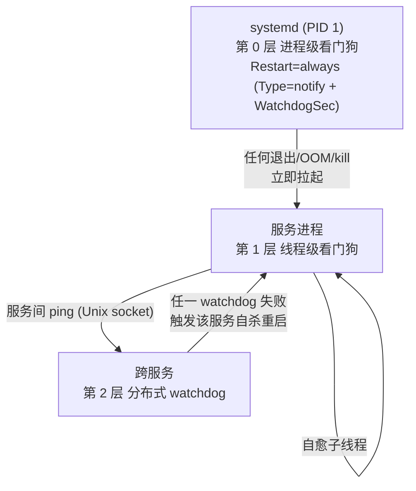
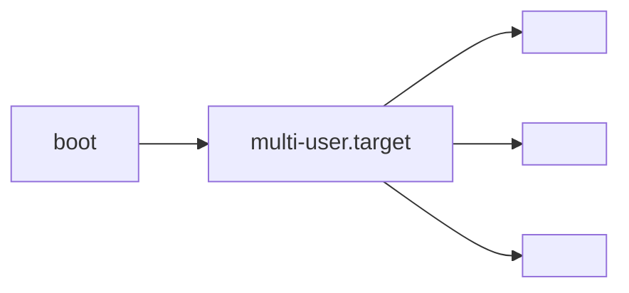

# 太昊 OS 内置服务设计

> **总纲:内置服务是系统看门狗服务进程,伴随系统启动自动启动,且无法被 kill。**

## 1. 设计原则

| 原则 | 说明 |
|---|---|
| 伴随启动 | `default.target` → `multi-user.target` 拉起,systemd 保证 boot 后立即 active |
| 不可 kill | 用户态 `kill / killall / pkill` 无法真正终止服务(看门狗立即重启) |
| 只能停机 | 唯一停止方式:`systemctl stop <svc>` 或 `systemctl mask <svc>`(需 root) |
| 自动恢复 | 进程 crash / OOM / 异常退出后,systemd 自动拉起 |
| 依赖有序 | 服务按依赖拓扑启动,故障时按拓扑回退 |
| 隔离运行 | 沙箱限制越权,服务无法互相影响 |

## 2. 不可 kill 机制



## 3. 启动时序



## 4. 统一 unit 模板

```ini
[Unit]
Description=Taihao OS · <Name> (<name>)
After=<本服务依赖的 earlier 服务列表>
Wants=<软依赖列表>

[Service]
Type=notify
ExecStart=/usr/bin/<name>
Restart=always
RestartSec=1s
WatchdogSec=30
NotifyAccess=main
User=taihao
Group=taihao

NoNewPrivileges=true
ProtectSystem=strict
ProtectHome=true
PrivateTmp=true
PrivateDevices=true
ProtectKernelTunables=true
ProtectKernelModules=true
ProtectControlGroups=true
RestrictAddressFamilies=AF_UNIX AF_INET AF_INET6
RestrictNamespaces=true
LockPersonality=true
RestrictRealtime=true
RestrictSUIDSGID=true
SystemCallArchitectures=native
SystemCallFilter=@system-service
MemoryDenyWriteExecute=true

RuntimeDirectory=taihao-os
RuntimeDirectoryMode=0750
LimitNOFILE=4096
MemoryMax=256M

ReadOnlyPaths=/etc/taihao-os /usr/share/taihao-os/skills
ReadWritePaths=/var/lib/taihao-os /var/log/taihao-os

StandardOutput=journal
StandardError=journal
SyslogIdentifier=<name>

[Install]
WantedBy=multi-user.target
```

## 5. 统一进程接口

所有内置服务共用 `src/taihao-common/`:
- `init_logging()` — 统一日志
- `paths()` — `/run/taihao-os/`, `/var/lib/taihao-os/`
- `Envelope<T>` — 总线消息协议
- `service_watchdog::run()` — 看门狗喂狗线程
- `sd_notify::*` — 封装 systemd 通知 API

## 6. 服务清单

| 服务名 | 角色 | 端口 | Watchdog | unit |
|---|---|---|---|---|
|  |  |  |  |  |

## 7. 连网服务

> 服务 1(从 0 到 1 规划的第一个服务)

### 7.1 设计思路

- 网络抽离一个**抽象协议层**
- 内置服务(联网服务)负责:
 - 读网络配置
 - 如果没有配置:自己建一个 AP 热点,并暴露**连网功能页面**供其他设备接入配置
- 抽象协议层实际上是 **HAL 层**
- 应用不关注 Wi-Fi 这类具体硬件型号

## 8. 资源 + 路径约定

| 路径 | 用途 |
|---|---|
| `/usr/bin/<服务名>` | 服务二进制 |
| `/etc/taihao-os/` | 全局配置(只读) |
| `/usr/share/taihao-os/skills/` | SKILL 集合(只读) |
| `/var/lib/taihao-os/` | 运行时持久化 |
| `/var/log/taihao-os/` | 审计 + 日志 |
| `/run/taihao-os/` | 运行时 socket / 目录(重启清空) |
