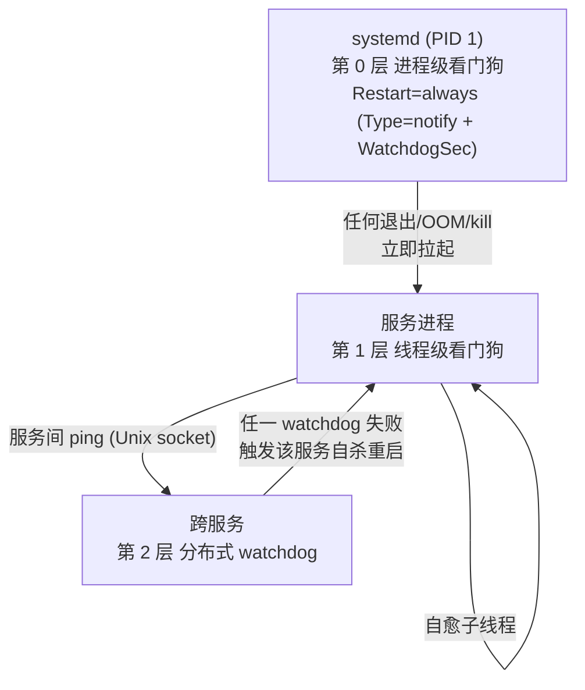
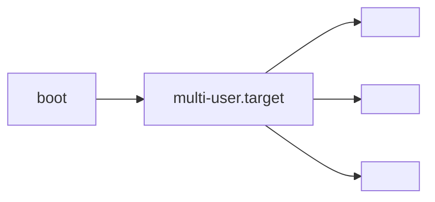

# 太昊 OS 内置服务设计

| 字段 | 值 |
|---|---|
| 版本 | v0.0.3 |
| 范围 | 内置服务架构骨架 + 服务 1(连网服务)设计 |
| 受众 | 太昊 OS 维护者 |
| 变更内容 | v0.0.1 初稿;v0.0.2 §2 标题改为"## 2. 服务 1:连网服务"显式编号,§2.1 列表改纯段落;v0.0.3 删除 §2 重复 blockquote "从 0 到 1 规划的第一个服务"(§2.1 设计思路已涵盖) |

## 1. 总体设计

### 1.1 背景与目的

太昊 OS 是智能终端 / 机器人设备端 OS,需一组随系统启动自动运行、用户态无法 kill 的内置服务作为系统基础设施。本文档定义这些内置服务的架构骨架,并按服务逐章展开详细设计。

### 1.2 设计原则

| 原则 | 说明 |
|---|---|
| 伴随启动 | `default.target` → `multi-user.target` 拉起,systemd 保证 boot 后立即 active |
| 不可 kill | 用户态 `kill / killall / pkill` 无法真正终止服务(看门狗立即重启) |
| 只能停机 | 唯一停止方式:`systemctl stop <svc>` 或 `systemctl mask <svc>`(需 root) |
| 自动恢复 | 进程 crash / OOM / 异常退出后,systemd 自动拉起 |
| 依赖有序 | 服务按依赖拓扑启动,故障时按拓扑回退 |
| 隔离运行 | 沙箱限制越权,服务无法互相影响 |

### 1.3 不可 kill 机制



### 1.4 启动时序



### 1.5 统一 unit 模板

```ini
[Unit]
Description=Taihao OS · <Name> (<name>)
After=<本服务依赖的 earlier 服务列表>
Wants=<软依赖列表>

[Service]
Type=notify
ExecStart=/usr/bin/<name>
Restart=always
RestartSec=1s
WatchdogSec=30
NotifyAccess=main
User=taihao
Group=taihao

NoNewPrivileges=true
ProtectSystem=strict
ProtectHome=true
PrivateTmp=true
PrivateDevices=true
ProtectKernelTunables=true
ProtectKernelModules=true
ProtectControlGroups=true
RestrictAddressFamilies=AF_UNIX AF_INET AF_INET6
RestrictNamespaces=true
LockPersonality=true
RestrictRealtime=true
RestrictSUIDSGID=true
SystemCallArchitectures=native
SystemCallFilter=@system-service
MemoryDenyWriteExecute=true

RuntimeDirectory=taihao-os
RuntimeDirectoryMode=0750
LimitNOFILE=4096
MemoryMax=256M

ReadOnlyPaths=/etc/taihao-os /usr/share/taihao-os/skills
ReadWritePaths=/var/lib/taihao-os /var/log/taihao-os

StandardOutput=journal
StandardError=journal
SyslogIdentifier=<name>

[Install]
WantedBy=multi-user.target
```

### 1.6 统一进程接口

所有内置服务共用 `src/taihao-common/`:

| 模块 | 用途 |
|---|---|
| `init_logging()` | 统一日志 |
| `paths()` | `/run/taihao-os/`, `/var/lib/taihao-os/` |
| `Envelope<T>` | 总线消息协议 |
| `service_watchdog::run()` | 看门狗喂狗线程 |
| `sd_notify::*` | 封装 systemd 通知 API |

## 2. 服务 1:连网服务

### 2.1 设计思路

网络抽离一个**抽象协议层**。内置服务(联网服务)负责:读网络配置;如果没有配置,自己建一个 AP 热点,并暴露**连网功能页面**供其他设备接入配置。抽象协议层实际上是 **HAL 层**,应用不关注 Wi-Fi 这类具体硬件型号。
