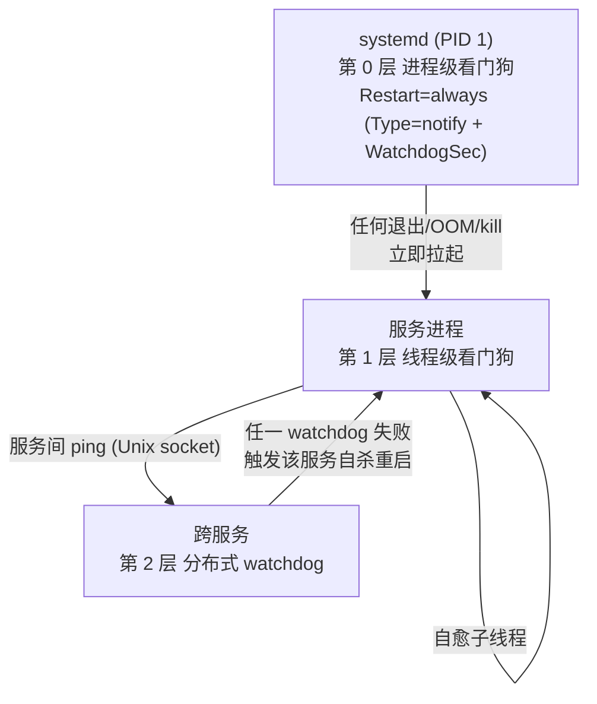
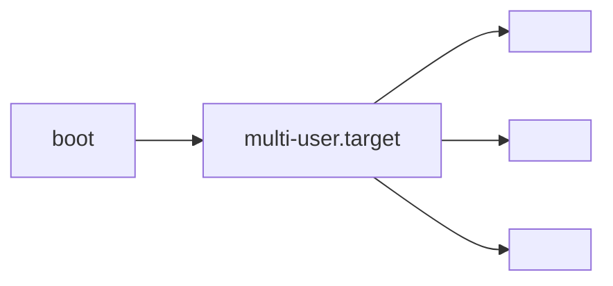

# 太昊 OS 内置服务设计

| 字段 | 值 |
|---|---|
| 版本 | v0.0.11 |
| 范围 | 内置服务架构骨架 + 连网服务设计 |
| 受众 | 太昊 OS 维护者 |
| 变更内容 | 连网服务重写为单服务 hostapd,承载完整网络接入流程,按 Linux 标准无线栈明确底层组件;去除自造概念(编排器 / 分层 / HAL / 事件通道 / 总线预设);v0.0.10 去除旧 comm-center 预设,内置服务从零定义 |

## 1. 总体设计

### 1.1 背景与目的

太昊 OS 是智能终端 / 机器人设备端 OS,需一组随系统启动自动运行、用户态无法 kill 的内置服务作为系统基础设施。本文档定义这些内置服务的架构骨架,并按服务逐章展开详细设计。

### 1.2 设计原则

| 原则 | 说明 |
|---|---|
| 伴随启动 | `default.target` → `multi-user.target` 拉起,systemd 保证 boot 后立即 active |
| 不可 kill | 用户态 `kill / killall / pkill` 无法真正终止服务(看门狗立即重启) |
| 只能停机 | 唯一停止方式:`systemctl stop <svc>` 或 `systemctl mask <svc>`(需 root) |
| 自动恢复 | 进程 crash / OOM / 异常退出后,systemd 自动拉起 |
| 依赖有序 | 服务按依赖拓扑启动,故障时按拓扑回退 |
| 隔离运行 | 沙箱限制越权,服务无法互相影响 |

### 1.3 不可 kill 机制



### 1.4 启动时序



### 1.5 统一 unit 模板

```ini
[Unit]
Description=Taihao OS · <Name> (<name>)
After=<本服务依赖的 earlier 服务列表>
Wants=<软依赖列表>

[Service]
Type=notify
ExecStart=/usr/bin/<name>
Restart=always
RestartSec=1s
WatchdogSec=30
NotifyAccess=main
User=taihao
Group=taihao

NoNewPrivileges=true
ProtectSystem=strict
ProtectHome=true
PrivateTmp=true
PrivateDevices=true
ProtectKernelTunables=true
ProtectKernelModules=true
ProtectControlGroups=true
RestrictAddressFamilies=AF_UNIX AF_INET AF_INET6
RestrictNamespaces=true
LockPersonality=true
RestrictRealtime=true
RestrictSUIDSGID=true
SystemCallArchitectures=native
SystemCallFilter=@system-service
MemoryDenyWriteExecute=true

RuntimeDirectory=taihao-os
RuntimeDirectoryMode=0750
LimitNOFILE=4096
MemoryMax=256M

ReadOnlyPaths=/etc/taihao-os /usr/share/taihao-os/skills
ReadWritePaths=/var/lib/taihao-os /var/log/taihao-os

StandardOutput=journal
StandardError=journal
SyslogIdentifier=<name>

[Install]
WantedBy=multi-user.target
```

### 1.6 统一进程接口

所有内置服务共用 `src/taihao-common/`:

| 模块 | 用途 |
|---|---|
| `init_logging()` | 统一日志 |
| `paths()` | `/run/taihao-os/`, `/var/lib/taihao-os/` |
| `Envelope<T>` | 总线消息协议 |
| `service_watchdog::run()` | 看门狗喂狗线程 |
| `sd_notify::*` | 封装 systemd 通知 API |

## 2. 连网服务(hostapd)

### 2.1 定位

`hostapd` 是太昊 OS 的内置连网服务,承载设备网络接入全流程。开机后读网络配置:存在有效配置则以客户端方式连接目标网络;无有效配置则自建热点并暴露配网页,外部设备经配网页提交网络凭据后切换为客户端连接。

服务名取自 Linux 无线栈标准 AP 守护进程 hostapd,命名即定位——该服务负责把设备接入网络。服务内部直接驱动标准无线组件实现上述行为,不引入自研抽象层。

### 2.2 工作模式

| 模式 | 触发条件 | 行为 |
|---|---|---|
| **客户端(STA)** | 存在有效配置 | 连接目标网络,取得地址后进入就绪 |
| **热点(AP)** | 无有效配置 / 连接失败回退 | 自建热点,提供地址分配与配网页 |

### 2.3 配网流程

1. 无有效配置 → 进入热点模式,SSID 形如 `taihao-<序列号后 4 位>`
2. 外部设备连接该热点,访问 `http://taihao.local`(mDNS)或 `http://192.168.4.1`
3. 配网页展示扫描到的网络,提交 SSID 与密码
4. 校验并保存配置,关闭热点,切换客户端连接
5. 连接成功 → 就绪;失败 → 回退热点模式重新配网

### 2.4 底层组件

服务驱动 Linux 标准无线栈实现上述行为:

| 组件 | 用途 |
|---|---|
| `wpa_supplicant` | 客户端连接(扫描 / 关联 / WPA 四步握手) |
| `hostapd` | 热点(802.11 AP 认证与加密) |
| `dnsmasq` | 热点模式下地址分配 |
| 内嵌 HTTP 配置页 | 收集网络凭据(SSID / 密码) |

### 2.5 配置、状态与安全

| 项 | 约定 |
|---|---|
| 配置存储 | `/var/lib/taihao-os/network/`,属主 `taihao:taihao`,权限 0600 |
| 状态暴露 | `/run/taihao-os/` 下状态接口,其它内置服务可查询,不预设总线 |
| 配网安全 | 热点启用 WPA2,口令为每设备唯一;配网页提交可加持有证明(PoP)校验 |
| 失败回退 | 连续连接失败(默认 5 次)回退热点模式重新配网 |
| 日志 | journald,`SyslogIdentifier=hostapd` |