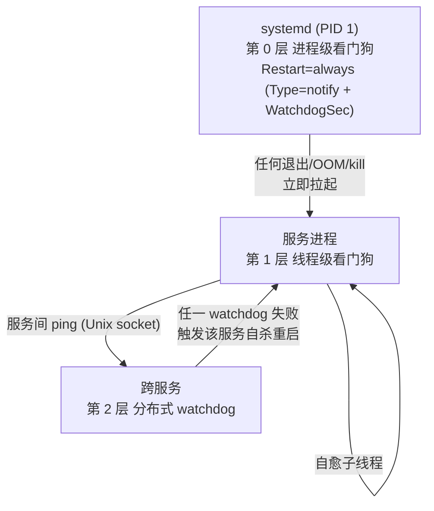
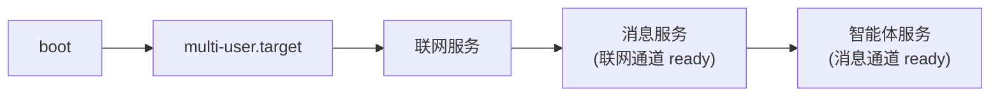
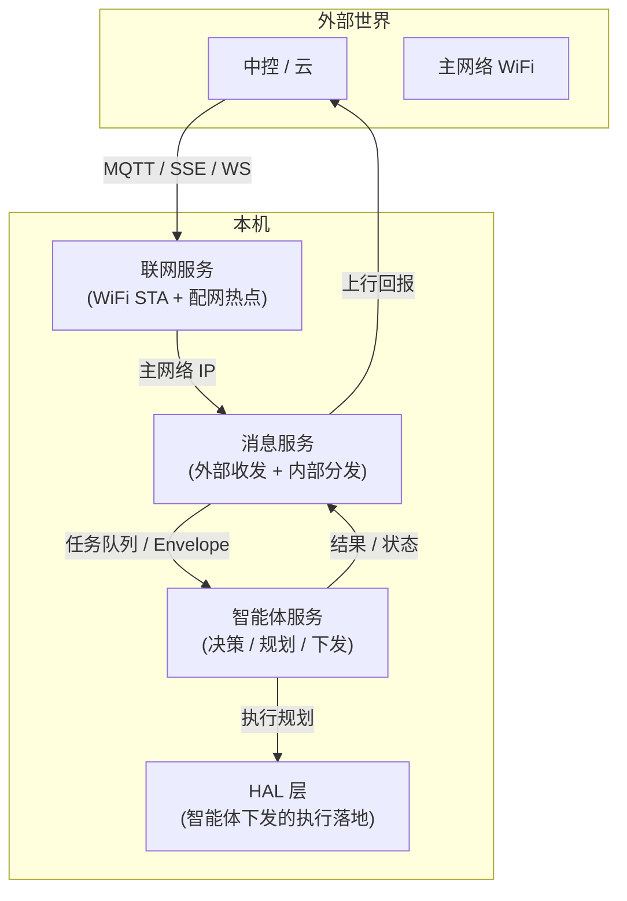
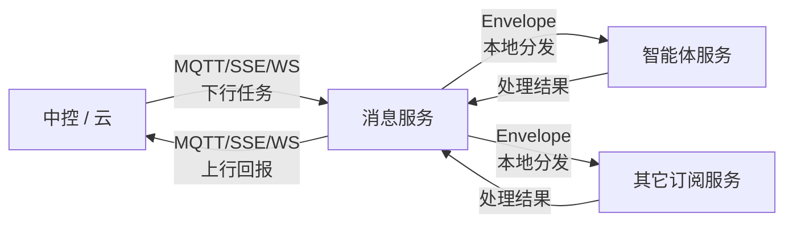
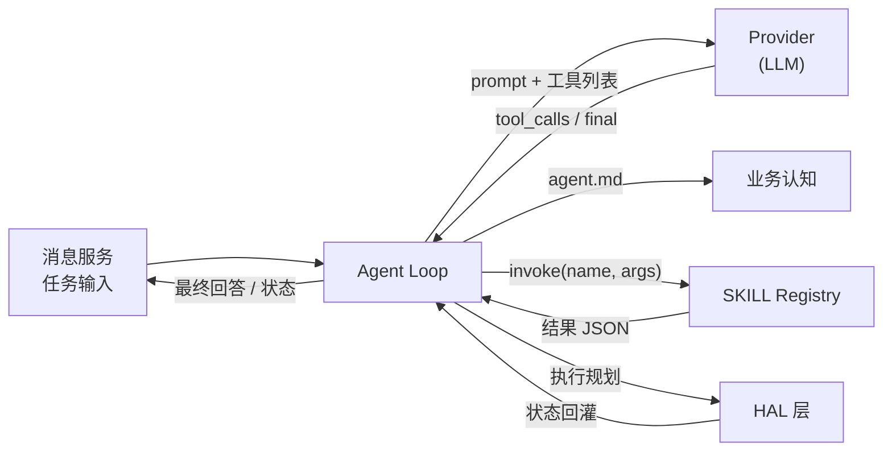

# 太昊 OS 内置服务设计

| 字段 | 值 |
|---|---|
| 版本 | v0.1.0 |
| 范围 | 3 个内置服务(联网 / 消息 / 智能体)+ 4 个接入规范(HAL / Provider / agent.md / skill.md) |
| 受众 | 太昊 OS 维护者 |
| 变更内容 | 大版本级重构:用户重新规划 5 步推进路径,内置服务从 4 精简为 3(联网 / 消息 / 智能体),组网推到设备管理期;消息服务吸收外部收发 + 内部分发(原任务中继 + comm-center 内总线合一);智能体服务吸收高层意图下发(原 rt-loop 折叠进 HAL 闭环);接入规范明确为 4 套:HAL / Provider / agent.md / skill.md |

## 1. 总体设计

### 1.1 背景与目的

太昊 OS 内置服务按"上电后到工作"的实际顺序规划,共 3 服务 + 4 规范 + 1 后期:

| 序 | 服务 / 规范 | 职责 |
|---|---|---|
| 1 | **联网服务** | 接入工作网络(WiFi STA + 配网热点回退) |
| 2 | **消息服务** | 外部消息收发(经联网服务通道)+ 内部消息分发(本地服务间) |
| 3 | **智能体服务(pi-agent)** | 高层任务决策 / 路径规划 / 监听任务反馈 / 下发执行规划 |
| 4 | **接入规范 4 套** | HAL 层 / Provider 标准 / agent.md 规范 / skill.md 规范 |
| 5 | 设备管理 + Mesh 组网 | 后期实现,本文档不展开 |

### 1.2 设计原则

| 原则 | 说明 |
|---|---|
| 伴随启动 | `default.target` → `multi-user.target` 拉起,systemd 保证 boot 后立即 active |
| 不可 kill | 用户态 `kill / killall / pkill` 无法真正终止服务(看门狗立即重启) |
| 只能停机 | 唯一停止方式:`systemctl stop <svc>` 或 `systemctl mask <svc>`(需 root) |
| 自动恢复 | 进程 crash / OOM / 异常退出后,systemd 自动拉起 |
| 依赖有序 | 服务按依赖拓扑启动,故障时按拓扑回退 |
| 隔离运行 | 沙箱限制越权,服务无法互相影响 |

### 1.3 不可 kill 机制



### 1.4 启动时序



联网服务最先生效(网络通道就绪),消息服务等联网服务 active 后拉起(有了通道才能与外部收发),智能体服务等消息服务 active 后拉起(有了消息源才有任务)。

### 1.5 统一 unit 模板

```ini
[Unit]
Description=Taihao OS · <Name> (<name>)
After=<本服务依赖的 earlier 服务列表>
Wants=<软依赖列表>

[Service]
Type=notify
ExecStart=/usr/bin/<name>
Restart=always
RestartSec=1s
WatchdogSec=30
NotifyAccess=main
User=taihao
Group=taihao

NoNewPrivileges=true
ProtectSystem=strict
ProtectHome=true
PrivateTmp=true
PrivateDevices=true
ProtectKernelTunables=true
ProtectKernelModules=true
ProtectControlGroups=true
RestrictAddressFamilies=AF_UNIX AF_INET AF_INET6
RestrictNamespaces=true
LockPersonality=true
RestrictRealtime=true
RestrictSUIDSGID=true
SystemCallArchitectures=native
SystemCallFilter=@system-service
MemoryDenyWriteExecute=true

RuntimeDirectory=taihao-os
RuntimeDirectoryMode=0750
LimitNOFILE=4096
MemoryMax=256M

ReadOnlyPaths=/etc/taihao-os /usr/share/taihao-os/skills
ReadWritePaths=/var/lib/taihao-os /var/log/taihao-os

StandardOutput=journal
StandardError=journal
SyslogIdentifier=<name>

[Install]
WantedBy=multi-user.target
```

### 1.6 统一进程接口

所有内置服务共用 `src/taihao-common/`:

| 模块 | 用途 |
|---|---|
| `init_logging()` | 统一日志 |
| `paths()` | `/run/taihao-os/`, `/var/lib/taihao-os/` |
| `Envelope<T>` | 消息总线协议 |
| `service_watchdog::run()` | 看门狗喂狗线程 |
| `sd_notify::*` | 封装 systemd 通知 API |

### 1.7 服务依赖拓扑



三服务串联:联网开路 → 消息通道 → 智能体决策 → HAL 落地 → 结果回灌。

## 2. 联网服务

### 2.1 定位

`联网服务` 是太昊 OS 的内置网络接入服务(iot 方案),承载设备接入主网络全流程。开机后读网络配置:存在有效配置则以客户端方式连接目标网络;无有效配置则自建热点并暴露配网页,外部设备经配网页提交网络凭据后切换为客户端连接。

服务名取自 Linux 无线栈标准 AP 守护进程 hostapd,命名即定位——该服务负责把设备接入主网络。服务内部直接驱动标准无线组件实现上述行为,不引入自研抽象层。

### 2.2 工作模式

| 模式 | 触发条件 | 行为 |
|---|---|---|
| **客户端(STA)** | 存在有效配置 | 连接目标网络,取得地址后进入就绪 |
| **热点(AP)** | 无有效配置 / 连接失败回退 | 自建热点,提供地址分配与配网页 |

### 2.3 配网流程

1. 无有效配置 → 进入热点模式,SSID 形如 `taihao-<序列号后 4 位>`
2. 外部设备连接该热点,访问 `http://taihao.local`(mDNS)或 `http://192.168.4.1`
3. 配网页展示扫描到的网络,提交 SSID 与密码
4. 校验并保存配置,关闭热点,切换客户端连接
5. 连接成功 → 就绪;失败 → 回退热点模式重新配网

### 2.4 底层组件

| 组件 | 用途 |
|---|---|
| `wpa_supplicant` | 客户端连接(扫描 / 关联 / WPA 四步握手) |
| `hostapd` | 热点(802.11 AP 认证与加密) |
| `dnsmasq` | 热点模式下地址分配 |
| 内嵌 HTTP 配置页 | 收集网络凭据(SSID / 密码) |

### 2.5 配置、状态与安全

| 项 | 约定 |
|---|---|
| 配置存储 | `/var/lib/taihao-os/network/`,属主 `taihao:taihao`,权限 0600 |
| 状态暴露 | `/run/taihao-os/network.sock`(Unix socket),其它内置服务可查询当前连接状态与地址 |
| 配网安全 | 热点启用 WPA2,口令为每设备唯一;配网页提交可加持有证明(PoP)校验 |
| 失败回退 | 连续连接失败(默认 5 次)回退热点模式重新配网 |
| 日志 | journald,`SyslogIdentifier=hostapd` |

## 3. 消息服务

### 3.1 定位

`消息服务` 是设备内外部双向消息流的统一通道。

- **外部**:经联网服务通道(MQTT / SSE / WS)与中控 / 云交换消息
- **内部**:经 Unix socket + Envelope 在本地服务(智能体服务 / 其它订阅方)之间分发消息,接收方处理后反馈,结果回灌后再上行回报

合并了原"任务中继"角色与原 comm-center 内部总线角色,统一为一个服务。

### 3.2 数据流



### 3.3 内部协议

复用 `src/taihao-common/Envelope<T>`:

```text
{
  source:    "<origin-service-id>",
  target:    "<dest-service-id> | broadcast",
  type:      "<message-type>",
  payload:   <T>,
  ts:        <unix-ms>,
  trace_id:  "<uuid>"
}
```

持久化与重试:
- 收件箱: `/var/lib/taihao-os/relay/inbox.db`(sqlite)
- 失败任务入重试队列,指数退避(默认 3 次)
- 已完成任务保留 24 h 供审计

### 3.4 输入与输出

| 方向 | 来源 / 目标 | 协议 |
|---|---|---|
| 输入(下行) | 中控 / 云,经联网服务通道 | MQTT / SSE / WebSocket |
| 输入(下行) | 内部服务发布 | Unix socket + Envelope |
| 输出(本地分发) | 智能体服务 / 其它订阅方 | Unix socket + Envelope |
| 输出(上行回报) | 中控 / 云,经联网服务回传 | MQTT / SSE / WebSocket |

### 3.5 配置、状态与安全

| 项 | 约定 |
|---|---|
| 配置 | `/etc/taihao-os/relay.toml`(`[upstream]` / `[subscribers]` / `[retry]` 三段) |
| 状态 | `/run/taihao-os/relay.sock`(Unix socket),可查询收件箱 / 重试队列状态 |
| 订阅白名单 | `[subscribers]` 段登记允许接收任务的服务名 |
| 任务签名 | 中控下发的下行任务须带签名,服务用中控公钥校验 |
| 日志 | journald,`SyslogIdentifier=msg-relay` |

## 4. 智能体服务(pi-agent)

### 4.1 定位

`智能体服务` 是太昊 OS 的认知决策层,负责:

- **高层任务决策**: 接收消息服务分发的任务,经 Agent Loop 决策
- **路径规划**: 基于当前状态与目标,产出运动 / 行为规划
- **监听任务反馈**: 持续监听 HAL 层回灌的执行状态
- **下发执行规划**: 将高层意图下发到 HAL 层落地

由 4 层装配,每层受对应接入规范约束:

| 层 | 模块 | 受何规范约束 |
|---|---|---|
| 业务认知层 | agent.md manifest | agent.md 规范(§5.3) |
| 推理层 | Agent Loop + Provider | Provider 规范(§5.2) |
| 工具层 | SKILL Registry | skill.md 规范(§5.4) |
| 执行层 | 执行规划下发 | HAL 规范(§5.1) |

### 4.2 数据流



### 4.3 装配机制

| 层 | 模块 | 职责 |
|---|---|---|
| Agent Loop | `agent_loop` | think → tool_call → observe 循环,每轮调用 LLM 一次 |
| 业务认知 | `agent.md` | 解析 agent.md manifest,加载 persona / 可用 skill 列表 / 工作模式 / hooks |
| SKILL Registry | `skill_registry` | 扫描 `/usr/share/taihao-os/skills/` 与 `/etc/taihao-os/skills/`,加载 SKILL.md 解析为可调用工具 |
| Provider | `provider` | OpenAI 兼容远端端点(`/v1/chat/completions`、`/v1/responses`),由 Provider 规范约束 |

### 4.4 高层意图下发

智能体产出的执行规划下发到 HAL 层(由 HAL 规范约束)。HAL 自带闭环控制(10-100Hz,类似旧 rt-loop 角色),把高层意图翻译成实际硬件动作并持续校调。

### 4.5 配置、状态与安全

| 项 | 约定 |
|---|---|
| 配置 | `/etc/taihao-os/agent.toml`(`[agent]` / `[provider]` / `[skills]` / `[hal]` 四段) |
| API Key | 走 secret store(`/var/lib/taihao-os/secrets/`,权限 0600),不入仓库 |
| 状态 | `/run/taihao-os/agent.sock`(Unix socket),其它服务可查询当前会话状态 |
| 日志 | journald,`SyslogIdentifier=pi-agent` |

## 5. 接入规范

4 套接入规范被智能体服务消费,共同决定 OS 对"硬件 / 模型 / 业务认知 / 工具"的接入方式。

### 5.1 HAL 规范

硬件抽象层接入标准,智能体下发的执行落到硬件的中间层。

| 项 | 约定 |
|---|---|
| 设备白名单 | (device, operation) 二元组,未登记调用一律拒绝 |
| 闭环控制 | 10-100Hz 闭环,把高层意图翻译成实际驱动并持续校调(对应旧 rt-loop 角色) |
| 审计 | 每次调用写 `/var/log/taihao-os/hal-audit.log`(JSON Lines) |
| Mock 驱动 | 仿真环境无硬件时返回 mock 数据,接口不变上层无感 |
| 接入方式 | Unix socket `/run/taihao-os/hal.sock`,智能体通过 Envelope 下发 Intent |

### 5.2 Provider 规范

大模型接入标准,所有 LLM 调用统一走 OpenAI 兼容远端端点。

| 项 | 约定 |
|---|---|
| 协议 | OpenAI 兼容:`/v1/chat/completions` + `/v1/responses` |
| 配置 | `/etc/taihao-os/provider.toml`(`base_url` / `api_key` / `model` / `timeout`) |
| API Key | 走 secret store(`/var/lib/taihao-os/secrets/`),不入仓库 |
| 失败重试 | 指数退避,默认 3 次 |
| 降级 | 远端不可达时降级到本地模型(NPU 接入见待补清单 2.1) |
| 多 Provider | 同一 agent.md 可声明多个 Provider,按规则路由 |

### 5.3 agent.md 规范

业务认知层 manifest,定义单个 agent 实例的能力与行为。

```markdown
---
name: <agent-name>
description: <一句话定位>
persona: |
  <人设 / 系统 prompt>
mode: <dialog | task | daemon>
providers:
  - <provider-name-1>
  - <provider-name-2>
skills:
  - <skill-name-1>
  - <skill-name-2>
hooks:
  pre-llm:  <hook-spec>
  post-llm: <hook-spec>
  pre-tool: <hook-spec>
  post-tool: <hook-spec>
---

<agent 正文,描述工作流与决策约束>
```

| 项 | 约定 |
|---|---|
| 位置 | `/etc/taihao-os/agents/<agent-name>/agent.md`(厂商级)→ `/usr/share/taihao-os/agents/<agent-name>/agent.md`(系统级,预留) |
| 工作模式 | `dialog`(对话)/ `task`(任务)/ `daemon`(守护)三选一 |
| 多 Provider | 同一 agent 可声明多个 Provider,智能体服务按规则路由 |
| Hooks | 4 个时机的扩展点,允许厂商扩展 |

### 5.4 skill.md 规范

SKILL 格式,智能体可调用的最小工具单元。兼容 Anthropic Agent Skills 规范。

```markdown
---
name: <skill-name>
description: <一句话定位>
parameters: |
  <JSON Schema,描述参数>
signature: <ed25519 签名 base64>
---

<skill 正文,描述能力与执行入口>
```

| 项 | 约定 |
|---|---|
| 位置 | `/usr/share/taihao-os/skills/<name>/SKILL.md`(系统级)→ `/etc/taihao-os/skills/<name>/SKILL.md`(厂商级),后者覆盖前者 |
| frontmatter | `name` / `description` / `parameters`(JSON Schema)/ `signature`(ed25519 验签) |
| 运行时 | SKILL Registry 启动时全量扫描,签名校验通过后载入 |
| 格式兼容 | Anthropic Agent Skills 规范 |

## 6. 设备管理与 Mesh 组网(后期)

不在本文档范畴。完成 1-4 闭环(联网 → 消息 → 智能体 + 接入规范)后,才进入设备管理期,涵盖:

- 设备清单与发现
- Mesh 组网(P2P / AP)
- 设备配置下发
- OTA 与回滚

详见后续设计文档。